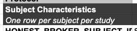
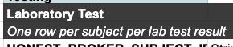
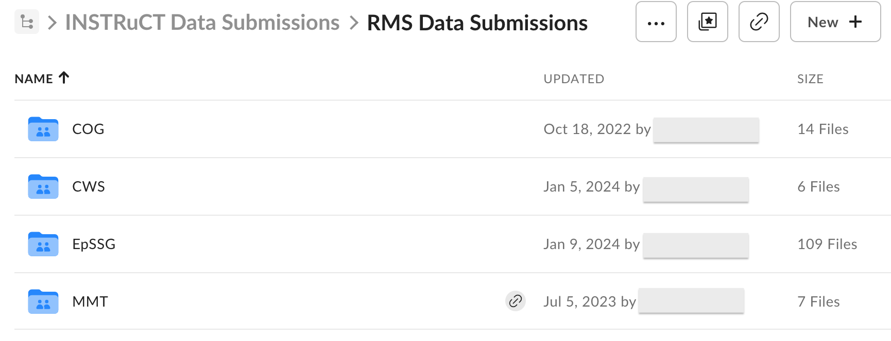
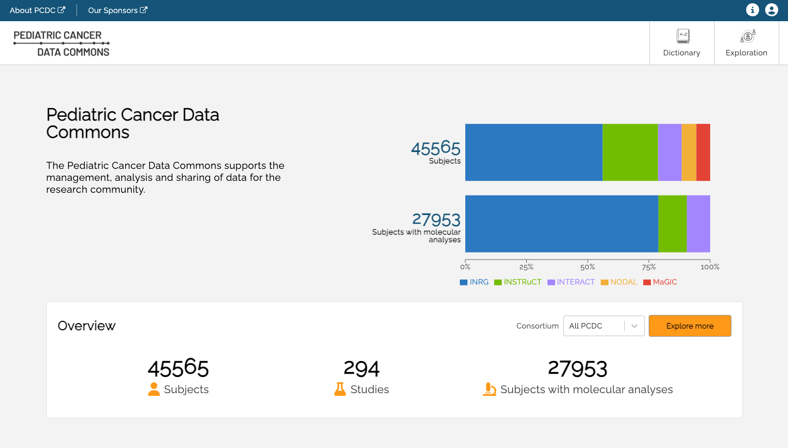
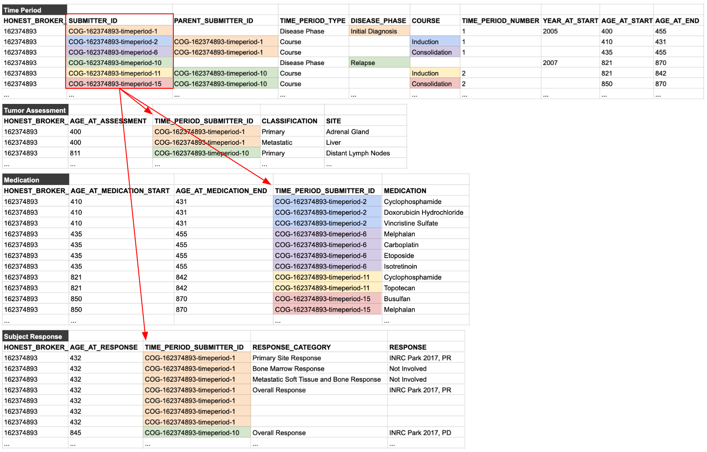

# PCDC Data Contribution Guide

## Who is this guide for?
This guide is intended for the individuals tasked with transforming an existing dataset into the PCDC format. These individuals typically have a variety of backgrounds (statisticians, data scientists, data managers, clinicians, etc.), but this guide will refer to such individuals as _data analysts_.

## Resources
Data analysts should have been provided with what D4CG calls a "Data Contributor Bundle". This is a spreadsheet consisting of three main components:
1. README - notes and guidance for your specific dataset.
2. Data Dictionary - tables, variables, and permissible values that constitute the target data format.
3. Data Sheets - with one sheet per data dictionary table, these are meant to contain your data once transformed and will be described in detail below.

If you have not received a Data Contributor Bundle, please reach out the the D4CG Data Standards and Modeling (DSM) team.

## What has already been done?
The data dictionary you will use is the result of many months of modeling work by disease experts in your consortium.

<video width="640" controls>
  <source src="/video/pcdc-overview-100mb.mp4" type="video/mp4">
  Your browser does not support the video tag.
</video>

## How long will this take?

### Pilot
The easiest way for the data analyst to learn the target data format, troubleshoot missing values or errors in the data dictionary, and to establish lines of communication with the DSM team is by starting the data transformation process with **a small pilot of 3-5 patients**. This isn't intended to take long, hopefully just a few days in the first few weeks.

We haven't had any groups who have not come back to the DSM team with questions at some point, and the most successful have been those who begin the pilot right away and quickly identify roadblocks.

### Full
The full transformation process for each dataset depends on a  variety of factors. The DSM team will plan on making **quarterly contact** with data analysts to ensure that any roadblocks are resolved without too much interim time lost.

**Ad hoc meetings** between the data analysts and the DSM team are also highly encouraged whenever question or issues arise.

## The Data Contributor Bundle

<video width="640" controls>
  <source src="/video/contributor-bundle-100mb.mp4" type="video/mp4">
  Your browser does not support the video tag.
</video>

### Table guidance
Each table has a specific instruction as to how each observation should be encoded. For example:

The <code>Subject Characteristics</code> table directs implementers to include <code>"One row per subject per study"</code>, "row" here meaning a row in the data sheet (specifically within the <code>subject_characteristics</code> data sheet). This row will describe a given patient's enrollment, data contributor, consortium, etc.

Contrast that to the <code>Laboratory Test</code> table, which some data dictionaries utilize. This directs implementers to include <code>"One row per subject per test result"</code>. This means that a single patient may have multiple rows/observations in the <code>laboratory_test</code> data sheet, as opposed to the single row/observation per patient within the <code>subject_characteristics</code> data sheet.

These are straightforward examples, while other tables may be more complicated and context dependent. We encourage all questions about table guidance statements to be sent to the D4CG DSM Team who can explain in more detail and provide additional examples.

### Implementation Notes

<code>D4CGNote</code> - general guidance from the DSM team, applies across consortia.

<code>ConsortiumNote</code> - specific guidance from the consortium data modeling group, applies to your consortium.

<code>ConditionalStatement</code> - related to tiering.

### Tiering

Resources are finite, so part of the data modeling process for some consortia have been to tier variables in the data dictionary. This is meant to communicate priorities to the data analysts.

#### Past Approaches
Tiering has evolved as the PCDC has matured. Each of these two approaches have been used by PCDC consortia and may be found within some data dictionaries.

|Tier|Explanation|
|----|----|
|Tier 1|Essential|
|Tier 2|Good to have|
|Tier 3|Nice to have, but not necessary|
|Tier 4|If we have it, we'll keep it/Defer|
|Tier 5|Don't care|

|Tier|Explanation|
|----|----|
|Tier 1|Contributors must include, regardless of the resource cost.|
|Tier 2|Contributors should prioritize inclusion if resources are available.|
|Tier 3|Contributors shouldn't prioritize inclusion, but can include if resourcs are available.|

#### Current Approach

The current approach is a bit more involved, but is capable to capturing the nuances of inter-variable relation and observation type conditionals.

|Tier|Example|Explanation|
|----|----|----|
|Mandatory|honest_broker_subject_id|Data can't go into the commons at all without this|
|^        |lab_type|Observation (lab result) don't make sense without this field (type of lab test).|
|Conditionally Mandatory|reconstruction_type|Mandatory field, but only relevant if this row/observation is a reconstruction procedure.|
|Conditionally Optional|resection_extent|Optional field, but only relevant if this row/observation is a resection procedure.|
|Optional|ethnicity|Not related to other variables, context, or conditions. Just purely optional.|

Example condition: <code>ConditionalStatement: If 'PROCEDURE' = 'Resection'</code>

Any "conditional" tiers will have an accompanying ConditionalStatement included in the Implementation Notes column of the dictionary. These conditions provide context-specific guidance for why a certain variable may be mandatory for some observation types and optional for others.

#### Re-tiering
The DSM team is happy to facilitate any re-tiering sessions that may be requested by the data analysts. This would involve a comprehensive review of all variables by a consortium group that is organized from those who previously worked on the data dictionary and those who are familiar with the datasets in question.

## Completed Data Transformation

### Box Folder

The University of Chicago uses Box, a cloud-based storage service, to store and share sensitive, confidential, or restricted information. A folder will be created for your institution by the D4CG Tech team which is where you can upload the transformed data for QA/QC. Data **should not be shared with D4CG** until a Data Contributor Agreement (DCA) has been fully executed for your institution.

### QA/QC

Quality assurance and quality control checks are a vital step before data can be loaded into the PCDC. The D4CG Tech team have an extensive process for checking conformance of submitted data to the target data dictionary, using abnormal or outlier values to detect erroneous observations, and finding gaps or inappropriate missingness.

### Uploaded to PCDC and available in the Data Portal

Once the dataset has passed QA/QC, it will be queued for an upcoming data release. When released it will be searchable on the Data Portal.

## FAQs

#### What does <code>&#95undefined&#95</code> mean?
The tabular version of the data dictionaries (viewed on Google Sheets) are designed to be parsed by code. To help with this parsing, each row in the spreadsheet has been given a "RowType". The <code>\_undefined\_</code> cell values are added so that permissible values are not defined on the same row as a variable. It is **not a valid permissible value** for any enumerated variable. If source data is missing, or a certain variable is not applicable to the observation being reported, you should not use <code>\_undefined\_</code>, but rather should use <code>Not Reported</code> or just be left blank as explained below.

####    <code><blank\></code> vs <code>Not Reported</code>
Each enumerated variable will have a list of permissible values. Most of these permissible value lists will include one for <code>Not Reported</code>. This should be used for missing source data.

However, there will also be times when the table in the data dictionary will have variables that are not related to a certain observation. To extend the tiering example above, the variable <code>recontruction_type</code> will not apply for a row/observation that is describing a biopsy. In these instances, the field should be left blank.

To summarize: 
If the field is missing in the source dataset, then use <code>Not Reported</code>. 
If the field is not applicable to a row/observation, then leave blank.

#### SUBMITTER_ID format
Despite what you may see in screenshots, examples, or other documentation, there is **no prescribed format** for submitter_id fields. The only requirement is that they are internally unique and consistent.

#### Time Periods
Time Periods are by far the most confusing aspect of the PCDC data model and usually require careful explanation and many examples. Privacy laws prohibit dates being included in de-identified datasets, which is why the PCDC model requires the age in days for events. However, it is common for an observation to not be date-stamped in the source data, but rather be attributed to a certain "phase" of disease (e.g., relapse or progression), or even to a "course" of treatment (e.g., induction or consolidation).

Thus, the PCDC data model allows an observation to have a specific age in days (for date-stamped source data), or to have a reference to a predefined time period (for source data with no date stamps). Groups will also commonly use both age in days _and_ time periods if that information is known.

Consider the following vignette and visualization that demonstrate the use of time periods:

> A 13 month-old patient is diagnosed with neuroblastoma and enrolled on a clinical trial. Her initial imaging shows a primary tumor in the adrenal gland and a metastasis in the liver. Her trial protocol calls for 3 week cycles of induction therapy followed by consolidation therapy. She shows a partial response to the treatment. Relapse is diagnosed a little over 1 year later in one of her lymph nodes. She is given additional cycles of re-induction therapy and subsequent consolidation therapy.

Once declared, these time periods can then be used to organize all of the reported data for the patient. This is done by using submitter_ids. A unique <code>SUBMITTER_ID</code> is declared for each time period and used throughout the rest of the tables in the data model, as shown below:

last updated: 04/04/25  
authored by: mwatkins