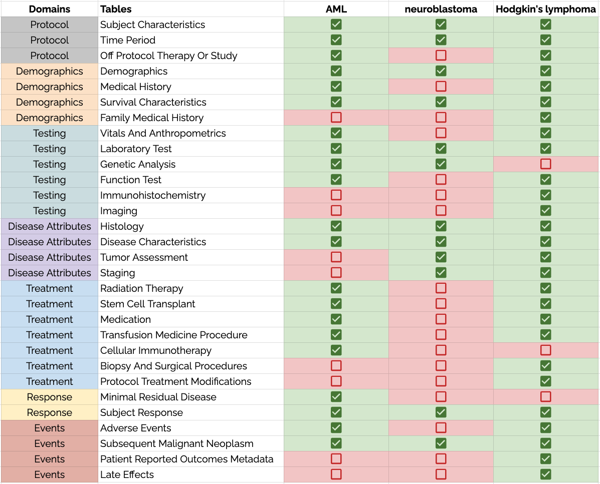
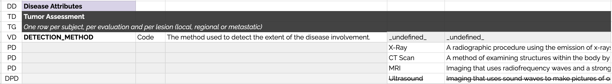

# PCDC Data Modeling Overview

## Data Model vs Data Dictionaries

By definition, a data commons has a single data model. This means that when any PCDC-affiliate disease consortia are reporting similar data--from dosing units to biopsy types--they use the same variables and permissible values. 

However, that's not to say that each disease uses _all_ the same variables and permissible values. Data dictionaries are used to constrain the data model to certain areas. The figure below shows how the data dictionaries for AML, neuroblastoma, and Hodgkin's lymphoma each draw from the same PCDC data model--using many of the same tables (collections of variables and values).

## Data Dictionary Format

To allow computational parsing of the data dictionaries, each row is tagged with a "RowType" which are explained below:

<code>DD</code> <u>D</u>omain <u>D</u>eclaration -  The row indicates the domain of the next table in the spreadsheet. 
<code>TD</code> <u>T</u>able <u>D</u>eclaration - The row is the beginning of a new table and includes the name of the table. 
<code>TG</code> <u>T</u>able <u>G</u>uidance - The row contains a short description of how the table should be implemented by contributors. 
<code>VD</code> <u>V</u>ariable <u>D</u>eclaration - The row describes a variable. The placeholder "&#95;undefined&#95;" is used to ensure that permissible values are not declared on the same row. 
<code>PD</code> <u>P</u>ermissible Value <u>D</u>eclaration - The row describes a permissible value. 
<code>DPD</code> <u>D</u>eprecated <u>P</u>ermissible Value <u>D</u>eclaration - The row describes a permissible value that was in the previous version of the data dictionary but is not to be used in the current version.

### Domains

At the highest level, the PCDC data model has seven domains. These are used to group related information and improves the human readability of the model. Domains have no computational meaning. Each domain is explained below: 

<code>Protocol</code> - relating to the consortium and institutional data contributor, to the timing of reported event, and to the patient's involvement in a clinical trial or study.  
<code>Demographics</code> - relating to patient characteristics and medical history.  
<code>Testing</code> - relating to various modes and types of testing.  
<code>Disease Attributes</code> - relating to the description of the disease. 
<code>Treatment</code> - relating to various modes and types of treatments administered to the patient. 
<code>Response</code> - relating to the assessment disease response to administered treatments. 
<code>Events</code> - relating to adverse events and other long-term outcomes.

### Tables

Tables are the primary structural organization in the PCDC data model. Variable names are unique within tables. Data are contributed to PCDC in spreadsheets--one for each table. Each table has specific guidance that specifies how it should be instantiated

### Variables

PCDC variables are named in UPPER_CASE and delimited with underscores "_". They are unique within their table, but not within the model. Data dictionaries include a column to identify which disease groups use a given variable. Each variable has a description and one or more terminology bindings (codes) each separated by a vertical pipe character " | ".

#### Data Types
<code>String</code> - free-text, can be a single word or multiple words. 
<code>Code</code> - one of a set list of permissible values. 
<code>Integer</code> - a whole number, typically reserved for ordinal variables (such as time period number) or the age of a patient. 
<code>Decimal</code> - for variables that are not guaranteed to be whole values, such as lab results, doses, etc.

#### Tiers
<code>1</code> - contributors must include, regardless of the resource cost  
<code>2</code> - contributors should prioritize inclusion if resources are available 
<code>3</code> - contributors shouldn’t prioritize inclusion, but can include if resources are available

### Values

Coded variables are followed by a list of permissible values. Data dictionaries include a column to identify which disease groups use a given permissible value. Each permissible value has a description and one or more terminology bindings separated by a vertical pipe character " | ".

### Implementation Notes

Any row can have one or more notes included in the implementation notes column. Each are separated by a vertical pipe character " | " and should indicate if the note is specific to a particular contributor or should be used by all contributors who are using that data dictionary. These notes provide additional guidance on how a table, variable, or value should be implemented by one or more data contributors. There is no additional required formatting for implementation notes and the individual groups can decide how to best use them.

### Mappings

The mappings column typically contains standardized mappings to the previous version of the data dictionary. Ideally, they allow transformation code to take the data from the previous version of the data dictionary into the current version. If there is no prior established version, this column is sometimes used to provide mappings to the source case report form (CRF) or registry.

#### [SSSOM](https://mapping-commons.github.io/sssom/spec/#common-mapping-predicates) Predicates
<code>skos:exactMatch</code>- target (current version) is the same as the source (previous version). 
<code>skos:narrowMatch</code>- the target (current version) is a narrower concept than the source (previous version). 
<code>skos:broadMatch</code>- the target (current version) is a broader concept than the source (previous version).

#### Standardized Mapping Format  
<code>_predicate_ [_disease_group_].[_previous_data_dictionary_version_].[_table_name_].[_variable_name_].[_permissible_value_]</code>

>Example 1: <I>Rename the TUMOR_CLASSIFICATION variable in the EWS data dictionary [v2.1]  to CLASSIFICATION in the EWS data dictionary [v2.2]</i>  
> (In the mapping column of the EWS data dictionary [v2.2] in the row of the renamed CLASSIFICATION variable)  
> <code>skos:exactMatch [EWS].[v2.1].[Tumor Assessment].[TUMOR_CLASSIFICATION]</code>
***  

>Example 2: <I>Rename the "MYCN Mutation" permissible value of the ALTERATION variable in the NBL data dictionary [v3.0]  to "MYCN Variant" in the NBL data dictionary [v3.1]</i>  
> (In the mapping column of the NBL data dictionary [v3.1] in the row of the renamed "MYCN Variant" permissible value)  
> <code>skos:exactMatch [NBL].[v3.0].[Genetic Analysis].[ALTERATION].[MYCN Mutation]</code>
***  

>Example 3: <I>Combine Karnofsky and Lanksy performance scores in the HL data dictionary [v1.0] into a single "PERFORMANCE_SCORE" variable in the HL data dictionary [v2.0]</i>  
> (In the mapping column of the HL data dictionary [v2.0] in the row of the new "PERFORMANCE_SCORE" variable)  
> <code>skos:narrowMatch [HL].[v1.0].[Disease Characteristics].[KARNOFSKY] || skos:narrowMatch [HL].[v1.0].[Disease Characteristics].[LANSKY]</code>  
> (In the mapping column of the HL data dictionary [v2.0] in the row of the "100" permissible value of the "PERFORMANCE_SCORE" variable)  
> <code>skos:narrowMatch [HL].[v1.0].[Disease Characteristics].[KARNOFSKY].[100] || skos:narrowMatch [HL].[v1.0].[Disease Characteristics].[LANSKY].[100]</code> 
***  

>Example 4: <I>Split some permissible values for the ENERGY_TYPE variable of the CNS data dictionary [v1.0] into a new "TECHNIQUE" variable in the CNS data dictionary [v1.1]</i>  
> (In the mapping column of the CNS data dictionary [v1.1] in the rows for <u>both</u> the ENERGY_TYPE and TECHNIQUE variables)  
> <code>skos:broadMatch [CNS].[v1.0].[Radiation Therapy].[ENERGY_TYPE]</code>

### Modeling Notes

Modeling notes are primarily used during the iterative data dictionary development process. This column can be used by both D4CG staff and collaborators to identify potential issues and record topics for discussion. There is no specific format for modeling notes.

## Semantic Versioning

Data dictionaries are versioned <code>[v <i>major</i>.<i>minor</i>]</code> according to the following rules:

<code>Major</code> - major releases occur after a prolonged period of dictionary development and a consortium-wide balloting process.  
<code>Minor</code> - minor releases occur after isolated changes to limited portions of the data dictionary are approved by the affected parties as-needed.

## Terminology Bindings

All variables and permissible values are bound to existing terminologies or ontologies for computable definitions. These are primarily C-codes from the NCI Thesaurus [(NCIt)](https://ncithesaurus.nci.nih.gov/ncitbrowser/) but also include:  
- ICD 9/10 - clinical diagnoses  
- [ICD-O](https://apps.who.int/iris/bitstream/handle/10665/96612/9789241548496_eng.pdf) - clinical diagnoses (oncology)  
- [SNOMED-CT](https://browser.ihtsdotools.org/?perspective=full&conceptId1=404684003&edition=MAIN/2023-05-31&release=&languages=en) - clinical findings  
- Sequence Ontology [(SO)](http://www.sequenceontology.org/browser/obob.cgi) - sequence annotations and genomic features  
- Uber-anatomy Ontology [(UBERON)](https://www.ebi.ac.uk/ols/ontologies/uberon) - body sites  
- Mondo Disease Ontology [(Mondo)](https://www.ebi.ac.uk/ols/ontologies/mondo) - disease classifications  
- [LOINC](https://loinc.org/) - tests and panels  
- [UCUM](https://ucum.org/ucum) - units of measure  
- [RxNorm](https://mor.nlm.nih.gov/RxNav/) - medications and drug ingredients  