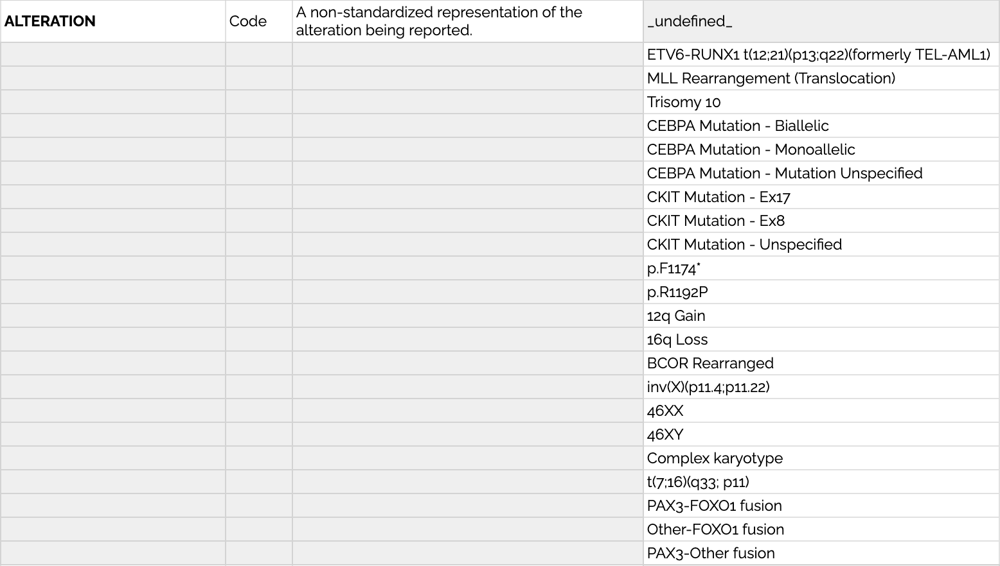
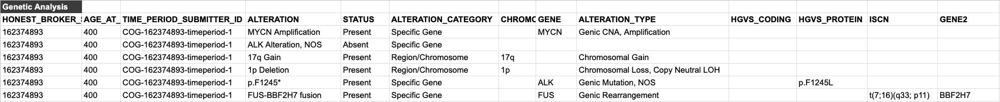

# Genomic Reporting in the PCDC Data Model

## Alterations
A universal issue in harmonizing clinical genomics data is differences in granularity. Some institutions may be capturing data at a very high level (e.g. MYCN amplification present), while others may capture data in a much more granular way (e.g. genomic coordinates, sequence annotations, HGVS or ISCN expressions, genotype, etc.).

In order to accomodate this range, we have an ALTERATION variable that represents the non-standardized "name" of the alteration itself. This can be whatever the disease group wants it to be--whatever they call the thing in their common parlance.

Below are examples of permissible values for ALTERATION that demonstrate this variability across several groups:

Additional details about an alteration can be represented in the remainder of the structured fields in the model (shown below).

### Chromosomal vs Genic 
Since the PCDC uses a flat data model it is important to remember that some variables and permissible values will only apply to chromosomal alterations and others will only apply to genic alterations. Although they are "mixed together" in the Genetic Analysis table, specific implementation guidance and quality checks will ensure that proper values are used for chromosomal and genic alterations respectively.

## Example
Below are examples of how alterations can be reported along with as many or few additional details as are present in the source data.

